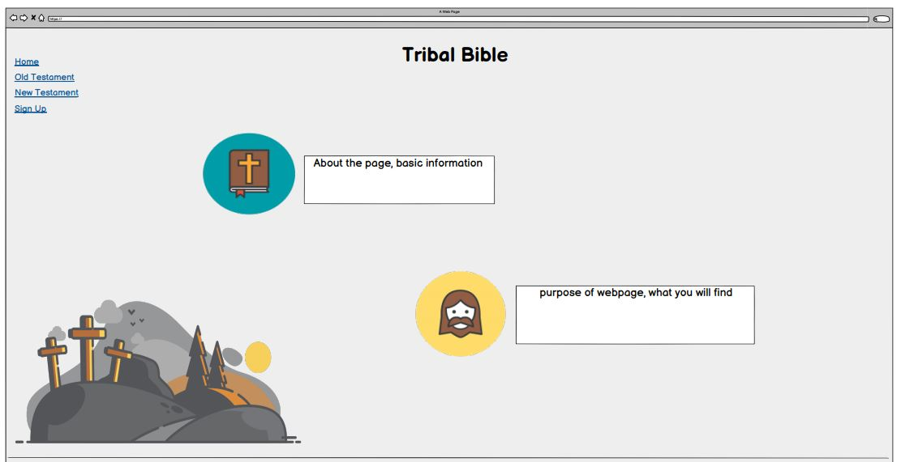
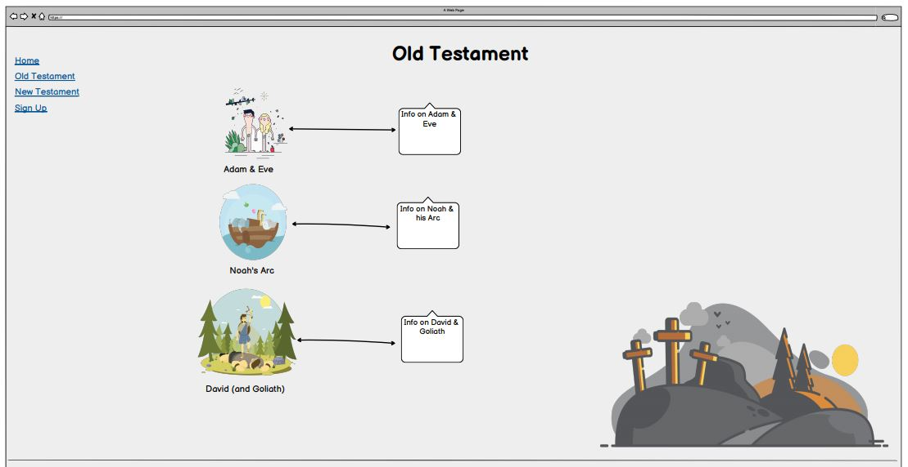
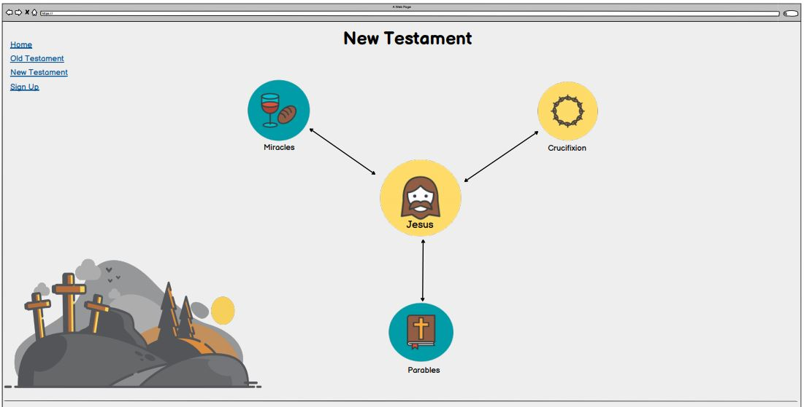
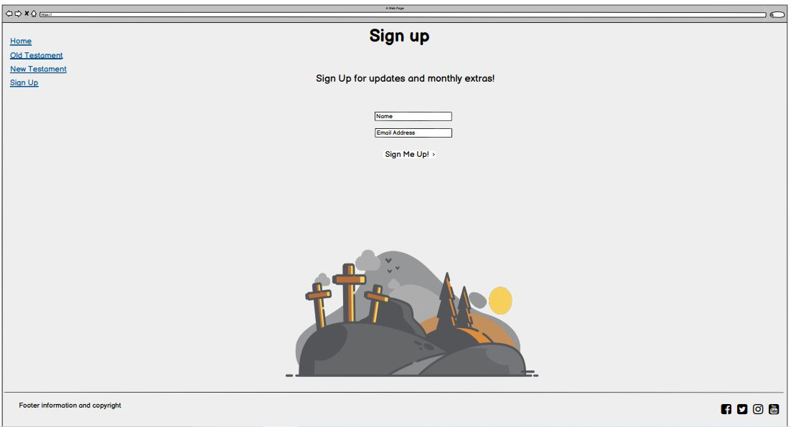

# Tribal Bible 

Tribal Bible is a child friendly website which will provide the child and parent with biblical infomation on people of the bible. Currently on the internet there are not many well designed child friendly theological websites, most have lots of adds with dull colours, and a lot of text. I have created Tribal Bible to be an up to date, good looking website which children would love to come onto and learn.

## UX

Currently online there are many websites that give Sunday School teachers information about bible stories and characters. These websites are dated, full of adverts and just look ugly. They also do not cater to the children,
the language will be hard for children to understand. Tribal Bible's goal is to reach children who want to learn about the bible without the need for teaching on Sundays.

There are alot of software and apps for adults to access information on theology, this is very lacking in regards to children. This is where the desire and idea for Tribal Bible came from, looking to create a one stop shop for children
to come and learn about Old Testament, New Testament and the people of the Bible. This is not a site to just tell the stories or to water down the Christian theology, the webpage is written for children but not watered down on information.

This website will require user stories from two different sides - The website creator and the potential children to use it.

### Wireframe Ideas

### **Website Creator**
As the website creator...
* I want children to see this as a helpful and fun place to visit online
* I want children and families to use the website to learn and grow in their faith
* I want families to sign up to recieve further information as well as to keep in communication with them

### **Children (user) Goals**
As a user of the website...
* I want to learn more about the bible 
* I want to see an appealing website which I can interact with
* I do not want to see adverts, I just want to see the content
* I want to find out more information and know when there are updates

## **Features**
Within this project there have been some key features that have been incorporated.

### **Navbar**
The Navbar has been created so that it will collapse as the screen size reduces. Once the Navbar has collapsed a small white bible appears on the top right, this bible replaces a hamburger dropdown navbar. Once clicked it will reveal the navigation links to the different sections.

### **Old Testament** 
Within the Old Testament section of the website there are three cards which look at different people from the Old Testament. These are placed within cards and have a button, once clicked the buttons will open a modal with more information on the chosen subject.

### **Sign Up**
The sign up section of the website is a form which requires the user to enter a name and email address, the form also gives the user an option to write a prayer request. The button which is located at the bottom of the form, will only work if a name and email address are entered. Once clicked this will open a new tab with a thank you response for signing up.

### **Footer**
The footer has a small navigation list of each section of the website, which when hovered over will change colour. The social links within the footer also change colour when hovered over and once clicked will open a new tab which takes the user to the corresponding website of the icon. 

## **Technology Used**
This project uses the following technologies:

1. [HTML](https://html.spec.whatwg.org/) - for creating the layout and the structure of the website
1. [CSS](https://www.w3.org/TR/CSS/#css) - for styling the website’s HTML code
1. [Bootstrap](https://getbootstrap.com/) - for additional styling and adding responsiveness to the website
1. [JavaScript](https://www.javascript.com/) - for adding alerts to the demo forms on the website and for JS Scrollspy
1. [Git](http://github.com)- for version control

Technology used that is connected to [Bootstrap](https://getbootstrap.com/) for parts of the website to function correctly

1. [jQuery](https://jquery.com/)
2. [Popper.js](https://popper.js.org/)
3. [JavaScript](https://www.javascript.com/)

## **Testing**
This project code has been run through [W3 HTML validator](https://validator.w3.org/nu/) and [W3 CSS validator](http://www.css-validator.org/) and came back validated.

Alongside using the code checkers I have tested the website preview on different devices listed below
### Mobile & Tablet
* iPhone 6/7/8
* Kindle Fire HDX

### Laptop and Desktop
* Acer Aspire Laptop

## **Testing the Features**

### Old Testament buttons
* Go to Old Testament section
* Click on button 
* Modal opens. Click either cross or button to close modal

### Sign Up
* Go to the Sign Up section
* Try to submit the empty form and verify that an error message about the required fields appears
* Try to submit the form with an invalid email address and verify that a relevant error message appears
* Try to submit the form with all inputs valid and verify that a success message appears.

### Social Media links
* Go to footer
* Click on each of the social media icons to confirm another tab opens with a link to the social media platform the icon represents

## **Bugs and Problems**
This project code has been run through [W3 HTML validator](https://validator.w3.org/nu/) and [W3 CSS validator](http://www.css-validator.org/) and came back validated, although the css came back with no issues my HTML came back with two warnings. The first one is around my h1 heading and the other is about a section heading title.

### Problems 
* I am unable to know how to make my website sizes look correct of anything larger than an average desktop screen. Old Testament section has been the hardest to get to fit to different screen sizes 
* I struggled with getting the Navbar to stay the length of the container, it would run past the the container and leave a white panel on the right. I was able to fix this with overflow-x:hidden
* I have also been git commit -m through out the process, but forgot to git push after each git commit. For some reason I thought that you did the push once you were finished with the entire project

## **Deployment**

### GitHub Pages
To deploy a website on GitHub Pages, follow these steps:

1. Go to the repository page
1. Click on settings icon in the top of the page
1. Find "GitHub Pages" section
1. Click on the "Source" dropdown menu
1. Select "master branch" option
1. A green success message should appear in the "GitHub Pages" section with the link to the live preview of the project.
1. For more information please visit [here](https://docs.github.com/en/free-pro-team@latest/github/working-with-github-pages/configuring-a-publishing-source-for-your-github-pages-site)

### Local Deployment
To create a local copy of a repository, follow these steps:

1. Go to the repository page
1. Click on the "Clone or download" button in the top of the page
1. Click the check list icon on the right of the newly opened window to clone the repository using HTTPS
1. Open Terminal
1. Change the current working directory to the location where you want the cloned directory to be made
1. Type "git clone" and paste the URL you copied in step 3 and run the command
1. For more information please visit [here](https://docs.github.com/en/free-pro-team@latest/github/creating-cloning-and-archiving-repositories/cloning-a-repository).

## **Credits**
* The text content of this website is all original, written by myself

### Media
* The images have been taken from [Vecteezy](https://www.vecteezy.com/)
* The icons have been taken from [Font Awesome](https://fontawesome.com/)
* The fonts have been taken from [Google Fonts](https://fonts.google.com/)

### Coding Sources
* [CSS Tricks](https://css-tricks.com/) used to help with problems
* [Stack Overflow](https://stackoverflow.com/) used to troubleshoot issues
* [Bootstrap](https://getbootstrap.com/) used to create some of the structure and interactive parts of the website